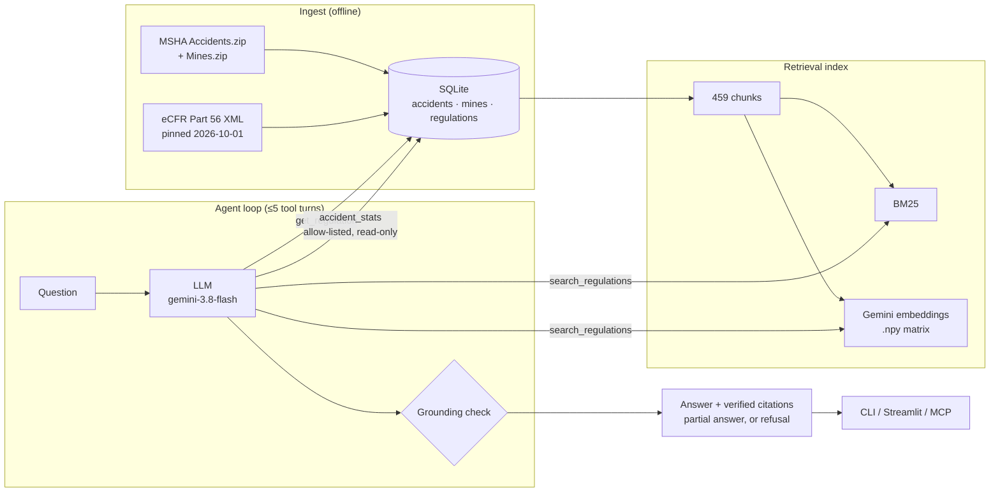

# Mine Safety Copilot

> **This is the `single-file` branch.** It adds the whole project as one notebook,
> [`mine_safety_copilot.ipynb`](mine_safety_copilot.ipynb), and one script,
> [`mine_safety_copilot.py`](mine_safety_copilot.py), generated from `src/` by
> `scripts/build_single_file.py` (a test keeps them in sync). Run the notebook from an empty folder
> in about a minute with a Gemini API key:
> [](https://colab.research.google.com/github/rameenft/mine-safety-copilot/blob/single-file/mine_safety_copilot.ipynb)
>
> Everything else is the same as [`main`](https://github.com/rameenft/mine-safety-copilot/tree/main), which is the primary version.

## Abstract

Mine Safety Copilot is a question-answering assistant for US **surface metal/nonmetal mines**
(quarries, open pits, sand and gravel, processing plants). It answers only from two official
sources, the federal safety standards in **30 CFR Part 56** and **MSHA accident records
(2021–2024)**. It cites the rule or record behind every claim, checks those citations and
numbers in code after the model answers, and says plainly when a question is outside what it
knows.

The project is as much about *measuring* the assistant as building it. It is scored on a
32-question evaluation set (30 correct, 0.94), and it was also checked by hand against outside
sources. The manual checks found problems the automatic score had hidden, and fixing them is
most of what changed between the first version and this one.

## Purpose

Mine safety staff need two kinds of answer: *what does the rule say* ("how high must a haul-road
berm be?") and *what actually happens* ("how many fatal accidents involved conveyors?"). The
rules are spread across about 420 legal sections, and the accident data sits in a 275,000-row
government file. A general chatbot will answer both kinds of question fluently, and it will also
invent a plausible regulation number or count. In safety work, **a confident wrong answer is
worse than no answer.**

The goal is an assistant whose answers can be **checked**, not just read:

1. Answer only from the two official sources, and cite the section or record behind every claim.
2. Verify citations and numbers **in code** after the model answers, rather than trusting it.
3. Refuse questions that are fully out of scope. Give a **partial answer** to half-in-scope
   questions, and say what isn't covered and where to look.
4. Measure all of this with an evaluation set, then check the system by hand against outside
   sources, not only against its own exam.

## Scope

| In scope | Out of scope |
|---|---|
| **30 CFR Part 56**: safety and health standards for surface metal/nonmetal mines (422 sections, eCFR text pinned to 2026-10-01) | Other parts: 46 (training), 60 (silica limits), 100 (penalties). The assistant points to them but doesn't answer from them |
| **MSHA accident records, 2021–2024**, surface metal/nonmetal only (12,900 records; 3,000 in the working sample, including all 80 fatalities) | Underground (Part 57) and coal mines, and any year outside 2021–2024 |
| Questions about what a rule says, what the accident records show, or both | Legal or financial advice, and anything the two sources can't support |

The assistant has three possible behaviours: **answer** (fully in scope), **partial answer**
(half in scope, with a `Not covered:` line and an approved pointer), and **refuse** (out of scope).

## How it works



Data is ingested once into SQLite and a retrieval index. At question time a model with three
tools reads the question, looks things up, and writes an answer. Then plain code checks that
every cited section, document number and figure actually appeared in the tool output.

| Component | Technique | Why |
|---|---|---|
| Data (ETL) | Filter 275k records to 12.9k in scope; **stratified sample** = all 80 fatalities plus a seeded random fill to 3,000; 11 injury codes mapped to 6 `SEVERITY` values | Keeps the rare, high-value rows and stays reproducible |
| Chunking | **Structure-aware**: whole sections, long ones split on paragraph breaks (≤1,500 chars; 422 sections → 459 chunks) | Every chunk keeps its section ID, so any hit can be cited and the full rule fetched |
| Retrieval | Dense (Gemini embeddings, cosine on a `.npy` matrix), BM25, and a weighted RRF hybrid | Dense chosen **by measurement** (recall@5 0.92 vs 0.85); no vector database needed at this size |
| Agent | 3 tools: `search_regulations`, `get_regulation`, `accident_stats`. Stats use **allow-listed typed filters** on a read-only DB, **no text-to-SQL** | The model can only pick from approved options, so it can't write a wrong or unsafe query |
| Grounding check | Every cited section, document number and figure must appear in tool output | Unsupported claims are stripped and flagged |
| Safety facts in code | Expired rule versions are hidden in the tool layer; today's date is given to the model | The model ignored a prompt rule *and* an explicit "EXPIRED" label |
| Evaluation | 32 questions; expected facts checked word-for-word against rule text, expected numbers computed by SQL; **rule-based scoring, no AI judge** | Deterministic and free to re-run; cached answers re-score offline |

## Results

**Agent evaluation: 32 questions, 30 correct (0.94).** Full report in
[`evals/reports/agent.md`](evals/reports/agent.md).

| Question type | n | Correct | Citation recall | Grounded |
|---|---|---|---|---|
| Regulation (incl. 1 expired-rule test) | 10 | 10 | 1.00 | 1.00 |
| Statistics | 7 | 7 | – | 1.00 |
| Rule + statistics | 4 | 3 | 1.00 | 1.00 |
| Partial (half in scope; 6 grey-zone + 1 silica) | 7 | 6 | 0.80 | 1.00 |
| Out of scope (must refuse) | 4 | 4 | – | 1.00 |
| **All** | **32** | **30 (0.94)** | **0.95** | **1.00** |

**Retrieval** ([report](evals/reports/retrieval.md)), 13 questions, top 5: dense recall **0.92**,
BM25 0.85, hybrid 0.85.

**Cost:** a full 32-question run is about 170k input and 24k output tokens (a few cents).
Embeddings are computed once, and cached answers re-score for free.

## What we improved after the first runs

The first version scored 24/24 on its own 24-question exam. That number turned out to be too
kind, so the second half of the project was spent looking for what it hid.

### 1. A bigger, harder question set

| Stage | Questions | What was added | Score at that stage |
|---|---|---|---|
| First build | 24 | 9 regulation, 7 statistics, 4 rule + statistics, 4 refuse | 24/24 (before stricter rules) |
| Grey-zone questions | 30 | +6 **partial** questions, e.g. "hard hats *and* training?" | 29/30 |
| Expired-rule checks | **32** | +1 regulation (reg-10), +1 partial (part-07, silica) | **30/32** |

The grey-zone questions showed the assistant needed a third behaviour between answering and
refusing. It now gives a partial answer with a `Not covered:` line and an approved pointer
(Part 46, 60, 100 and so on).

### 2. Manual checks against outside sources

| Check | What was done | Finding | Outcome |
|---|---|---|---|
| Read every answer | Read all 24 original answers as a safety manager would | Stats from the sample didn't say so; one called it "representative"; keyword counts said "involving" | Became scoring rules: the old 24 answers drop to **19/24**; the fixed prompt scores 29/30 on the 30-question set |
| Grey-zone questions | Added half-in-scope questions | Needed the partial-answer behaviour above | Partial answers with `Not covered:` and an approved pointer |
| Keyword matches | Read all 12 fatal narratives matched by keyword | Only 7 had the keyword as the cause; the cited rule fit some accidents and not others | Answers say "*mentioning*"; documented |
| Counts vs MSHA | Compared fatal counts with MSHA's official yearly figures | Raw data matches **exactly** (95 = 80 kept + 15 excluded underground) | Filters verified |
| Injury categories | Reviewed the 11 → 6 severity mapping | Sound; `other` mixes illness, natural causes and non-employees | Documented; the tool now explains it |
| Rule versions | Checked the two silica/dust rule pairs | Expired versions were being cited; the silica limit itself is in Part 60 | Fixed in code; 2 questions added |
| Rule text vs eCFR | Word-by-word diff of 5 sections, including the longest | Identical; chunks rebuild losslessly | Ingest verified |

Details are in [`docs/DATA_CARD.md`](docs/DATA_CARD.md) and the reasoning behind each change is
in [`docs/DECISIONS.md`](docs/DECISIONS.md).

### 3. Two failures left visible on purpose

30 answers come from one run; the 2 expired-rule questions were run after the fix that handles
them. The two misses are not tuned away: **hyb-01** says "involving" instead of "mentioning",
and **part-07** refuses with a correct Part 60 pointer instead of giving a partial answer. Tuning
the prompt to pass one question would make the score look better without making the system
better.

## Limitations

| Limitation | Example | Status |
|---|---|---|
| Prompt rules aren't guaranteed | hyb-01 still says "involving conveyors"; caveats rely on the model following instructions | Measured by the eval, not enforced at runtime. Only tool-layer rules are guaranteed |
| Grounding checks numbers and citations, not meaning | A real section cited with its content paraphrased wrongly would pass | Partly covered by expected-fact scoring |
| Keyword counts overstate | 6 "conveyor" deaths, of which about 3 are clearly caused by a conveyor | Answers say "mentioning"; no fix for the cause itself |
| One rule per question | A dump-site death falls under §56.9301, not the berm rule §56.9300 | Not handled |
| Sample statistics | Non-fatal counts describe a 3,000-row sample that over-represents severe accidents | Caveat required in answers |
| Retrieval misses | For the conveyor question, the right rule wasn't in the top 5 dense results; the agent recovered by searching again | Small retrieval test set (13 questions) |
| Outdated or missing data | Accidents end in 2024; rules pinned to 2026-10-01; expired rule text can't be quoted for past accidents | Documented |
| Partial vs refuse boundary | part-07 refuses where a partial answer was expected | Left visible |
| Over MCP | The client's model writes the answer, so the grounding check doesn't run | Tool guardrails still apply |
| Evaluation bias | Questions written alongside the system, one model, small n (one miss moves a type by 0.11–0.25) | A regression gate, not a benchmark |

**Not legal or compliance advice.** Always check the current [eCFR](https://www.ecfr.gov/current/title-30/chapter-I/subchapter-N/part-56).

## What could be improved next

1. **Enforce answer rules in code:** add a post-check that inserts the sample caveat or "mentioning" wording when the model leaves it out, the same way grounding works.
2. **Held-out evaluation:** questions written by someone else, plus a comparison across models through the provider interface.
3. **Better coverage:** add Parts 46, 57 and 60, and keep dated rule versions so past accidents can be matched to the rule in force at the time.
4. **Finer data:** split `other` into illness, natural causes, non-employee and no-injury, and map accident types to their specific rules (dump sites → §56.9301).
5. **Cause, not keyword:** classify each narrative's cause instead of counting keyword matches.

## Ways to use it

- **CLI:** `python -m mine_copilot.agent "question"` (add `--json` for the full tool trace)
- **Streamlit demo:** example questions per type, a grounding badge, expandable cited sections, and the tool trace
- **MCP server:** lets Claude Desktop or Claude Code call the same tools (see below)
- **Single-file version:** the whole project as one notebook and one script lives on the
  [`single-file`](https://github.com/rameenft/mine-safety-copilot/tree/single-file) branch. It runs from an empty folder in about a minute with a Gemini API key.
  [](https://colab.research.google.com/github/rameenft/mine-safety-copilot/blob/single-file/mine_safety_copilot.ipynb)

## Quickstart

```bash
python -m venv .venv && source .venv/bin/activate
pip install -e ".[dev,demo,mcp]"
cp .env.example .env                          # add GEMINI_API_KEY
python -m mine_copilot.ingest.build           # download + build the SQLite DB
python -m mine_copilot.retrieval.build        # chunk + embed (--no-embed for BM25 only)
python -m mine_copilot.agent "How high must berms be on haul roads?"
streamlit run src/mine_copilot/app.py         # demo UI
pytest -q                                     # 53 offline tests
python evals/eval_agent.py --model gemini-3.8-flash   # eval (cached; --rescore offline)
claude mcp add mine-safety-copilot -- "$PWD/.venv/bin/python" -m mine_copilot.mcp_server
```

For Claude Desktop, add `{"mcpServers": {"mine-safety-copilot": {"command":
"/absolute/path/.venv/bin/python", "args": ["-m", "mine_copilot.mcp_server"]}}}` to
`claude_desktop_config.json`.

## Repository layout

```
mine_safety_copilot.ipynb / .py   the whole project in one file (generated)
scripts/            build_single_file.py
src/mine_copilot/   ingest/ retrieval/ agent/ llm.py config.py demo.py app.py mcp_server.py
evals/              golden_set.yaml, build_golden.py, eval_*.py, reports/
tests/              53 offline tests + fixtures/ (including rows that must be rejected)
docs/               DATA_CARD.md (data and filters), DECISIONS.md (why), LEARNING_LOG.md
```

## Data sources and license

- [MSHA open government data](https://arlweb.msha.gov/OpenGovernmentData/OGIMSHA.asp): accidents and mines
- [eCFR](https://www.ecfr.gov/) Title 30 Part 56 (US government work, public domain)

Code is under the [LICENSE](LICENSE) in this repository. Raw and processed data are not committed;
the ingest step rebuilds them.
