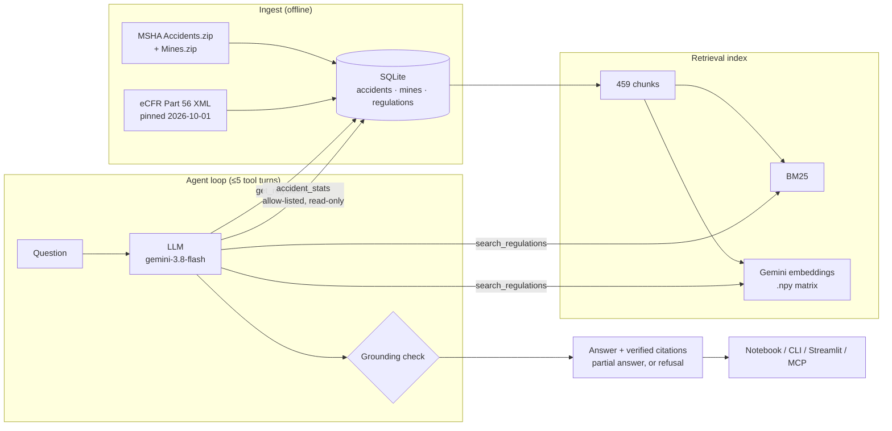

# Mine Safety Copilot

A question-answering assistant for US **surface metal/nonmetal mines** (quarries, open pits, sand
and gravel, processing plants). It answers only from **30 CFR Part 56**, the federal safety
standards, and **MSHA accident records (2021–2024)**. It cites the exact rule or record behind
every claim and says plainly when a question is outside what it knows.

**Start here:** [`mine_safety_copilot.ipynb`](mine_safety_copilot.ipynb) is the whole project in
one notebook. You can read it with its saved outputs, or run it from an empty folder in about a
minute with a Gemini API key.
[](https://colab.research.google.com/github/rameenft/mine-safety-copilot/blob/main/mine_safety_copilot.ipynb)

## Context

Mine safety staff need two kinds of answer: *what does the rule say* ("how high must a haul-road
berm be?") and *what actually happens* ("how many fatal accidents involved conveyors?"). The rules
are spread across about 420 legal sections, and the accident data sits in a 275,000-row
government file. A general chatbot will answer both kinds of question fluently, and it will also
invent a plausible regulation number or count. In safety work, **a confident wrong answer is
worse than no answer.**

## Goal

Build an assistant whose answers can be **checked**, not just read:

1. Answer only from the two official sources, and cite the section or record behind every claim.
2. Verify citations and numbers **in code** after the model answers, rather than trusting it.
3. Refuse questions that are fully out of scope. Give a **partial answer** to half-in-scope ones
   and say what's not covered and where to look.
4. Measure all of this with an evaluation set, then **check the system by hand against outside
   sources**, not only against its own exam.

## Constraints

| Constraint | Effect on the design |
|---|---|
| One-day build, solo | Narrow scope: one rulebook (Part 56), one mine type, four years |
| Gemini free tier (20 requests/day), then $5 of credit | Provider interface, BM25 fallback with no key, cached eval answers, offline re-scoring |
| Public data only | MSHA open data + eCFR, pinned to a fixed snapshot so results are reproducible |
| One model (gemini-3.8-flash) | Results aren't compared across models |

## Architecture



| Component | Technique | Why |
|---|---|---|
| Data (ETL) | Filter 275k records to 12.9k in scope; **stratified sample** = all 80 fatalities + seeded random fill to 3,000; 11 injury codes → 6 `SEVERITY` values | Keeps the rare, high-value rows and stays reproducible |
| Chunking | **Structure-aware**: whole sections, long ones split on paragraph breaks (≤1,500 chars, 422 → 459 chunks) | Every chunk keeps its section ID, so any hit can be cited and the full rule fetched |
| Retrieval | Dense (Gemini embeddings, cosine on a `.npy` matrix), BM25, weighted RRF hybrid | Dense chosen **by measurement** (recall@5 0.92 vs 0.85); no vector DB needed at this size |
| Agent | 3 tools; stats via **allow-listed typed filters** on a read-only DB, **no text-to-SQL** | The model can only pick from approved options, so it can't write a wrong or unsafe query |
| Grounding check | Every cited section, document number and figure must appear in tool output | Unsupported claims are stripped and flagged |
| Safety facts in code | Expired rule versions hidden in the tool layer; today's date given to the model | The model ignored a prompt rule *and* an explicit "EXPIRED" label |

## What was achieved

**Evaluation: 32 questions, 30 correct (0.94).** These are six kinds of question, each with
expected facts checked word-for-word against the rule text and expected numbers computed by SQL.
Scoring is **rule-based** (no AI judge), so it's deterministic and free to re-run.
[Full report](evals/reports/agent.md).

| Question type | n | Correct | Citation recall | Grounded |
|---|---|---|---|---|
| Regulation (incl. 1 expired-rule test) | 10 | 10 | 1.00 | 1.00 |
| Statistics | 7 | 7 | – | 1.00 |
| Rule + statistics | 4 | 3 | 1.00 | 1.00 |
| Partial (half in scope; 6 grey-zone + 1 silica) | 7 | 6 | 0.80 | 1.00 |
| Out of scope (must refuse) | 4 | 4 | – | 1.00 |
| **All** | **32** | **30 (0.94)** | **0.95** | **1.00** |

The set grew from 24 to 32 during manual review, with 6 grey-zone and 2 expired-rule questions
added. 30 answers come from one run, and the 2 expired-rule questions were run after the fix that
handles them. The two misses are left visible rather than tuned away: hyb-01 says "involving"
instead of "mentioning", and part-07 refuses with a correct Part 60 pointer instead of giving a
partial answer.

**Retrieval** ([report](evals/reports/retrieval.md)): dense recall@5 **0.92**, BM25 0.85, hybrid 0.85.

**Manual review: checking the system against outside sources.** The original 24 questions scored
24/24 automatically. Reviewing by hand found what that score hid:

| Check | What was done | Finding | Outcome |
|---|---|---|---|
| Read every answer | Read all 24 answers as a safety manager would | Stats from the sample didn't say so; one called it "representative"; keyword counts said "involving" | Became scoring rules: old answers drop to **19/24**, the fixed prompt scores 29/30 |
| Grey-zone questions | Added half-in-scope questions ("hard hats *and* training?") | Needed a third behaviour between answering and refusing | Partial answers with `Not covered:` and an approved pointer (Part 46, 60, 100…) |
| Keyword matches | Read all 12 fatal narratives matched by keyword | Only 7 had the keyword as the cause; the cited rule fit some accidents and not others | Answers say "*mentioning*"; documented |
| Counts vs MSHA | Compared fatal counts with MSHA's official yearly figures | Raw data matches **exactly** (95 = 80 kept + 15 excluded underground) | Filters verified |
| Injury categories | Reviewed the 11 → 6 severity mapping | Sound; `other` mixes illness, natural causes, non-employees | Documented; the tool now explains it |
| Rule versions | Checked the two silica/dust rule pairs | Expired versions were being cited; the silica limit itself is in Part 60 | Fixed in code; 2 questions added |
| Rule text vs eCFR | Word-by-word diff of 5 sections, including the longest | Identical; chunks rebuild losslessly | Ingest verified |

Details in [`docs/DATA_CARD.md`](docs/DATA_CARD.md), reasoning in [`docs/DECISIONS.md`](docs/DECISIONS.md).

**Deliverables:**
- a one-file notebook and script, generated from the package and kept in sync by a test
- a CLI and a Streamlit demo
- an **MCP server**, so Claude Desktop or Claude Code can use the same tools
- **53 offline tests**, including fixtures with rows that *must be rejected* and a scripted fake model

**Cost:** a full 32-question run is about 170k input and 24k output tokens (a few cents).
Embeddings are computed once, and cached answers re-score for free.

## Where it can fail

| Failure mode | Example | Status |
|---|---|---|
| Prompt rules aren't guaranteed | hyb-01 still says "involving conveyors"; caveats rely on the model following instructions | Measured by the eval, not enforced at runtime. Only tool-layer rules are guaranteed |
| Grounding checks numbers and citations, not meaning | A real section cited with its content paraphrased wrongly would pass | Partly covered by expected-fact scoring |
| Keyword counts overstate | 6 "conveyor" deaths, of which about 3 are clearly caused by a conveyor | Answers say "mentioning"; no fix for the cause itself |
| One rule per question | A dump-site death falls under §56.9301, not the berm rule §56.9300 | Not handled |
| Sample statistics | Non-fatal counts describe a 3,000-row sample that over-represents severe accidents | Caveat required in answers |
| Retrieval misses | For the conveyor question, the right rule wasn't in the top 5 dense results; the agent recovered by searching again | Small retrieval test set (13 questions) |
| Outdated or missing data | Accidents end in 2024; rules pinned to 2026-10-01; expired rule text can't be quoted for past accidents | Documented |
| Partial vs refuse boundary | part-07 refuses where a partial answer was expected | Left visible |
| Over MCP | The client's model writes the answer, so the grounding check doesn't run | Tool guardrails still apply |
| Eval bias | Questions written alongside the system, one model, small n (one miss = 0.11–0.25 per type) | A regression gate, not a benchmark |

Not legal or compliance advice. Always check the current eCFR.

## What I'd improve next

1. **Enforce answer rules in code:** add a post-check that adds the sample caveat or "mentioning" wording when the model leaves it out, the same way grounding works.
2. **Held-out evaluation:** questions written by someone else, plus a comparison across models through the provider interface.
3. **Better coverage:** add Parts 46, 57 and 60, and keep dated rule versions so past accidents can be matched to the rule in force at the time.
4. **Finer data:** split `other` into illness, natural causes, non-employee and no-injury, and map accident types to their specific rules (dump sites → §56.9301).
5. **Cause, not keyword:** classify each narrative's cause instead of counting keyword matches.

## Run it

```bash
python -m venv .venv && source .venv/bin/activate
pip install -e ".[dev,demo,mcp]"
cp .env.example .env                          # add GEMINI_API_KEY
python -m mine_copilot.ingest.build           # download + build the SQLite DB
python -m mine_copilot.retrieval.build        # chunk + embed (--no-embed for BM25 only)
python -m mine_copilot.agent "How high must berms be on haul roads?"   # --json for the trace
streamlit run src/mine_copilot/app.py         # demo UI
pytest -q                                     # 53 offline tests
python evals/eval_agent.py --model gemini-3.8-flash   # eval (cached; --rescore offline)
claude mcp add mine-safety-copilot -- "$PWD/.venv/bin/python" -m mine_copilot.mcp_server
```

For Claude Desktop, add `{"mcpServers": {"mine-safety-copilot": {"command":
"/absolute/path/.venv/bin/python", "args": ["-m", "mine_copilot.mcp_server"]}}}` to
`claude_desktop_config.json`.

## Repo layout

```
mine_safety_copilot.ipynb / .py   the whole project in one file (generated)
src/mine_copilot/   ingest/ retrieval/ agent/ llm.py config.py demo.py app.py mcp_server.py
evals/              golden_set.yaml, build_golden.py, eval_*.py, reports/
tests/              offline tests + fixtures/
scripts/            build_single_file.py
docs/               DATA_CARD.md, DECISIONS.md
```
