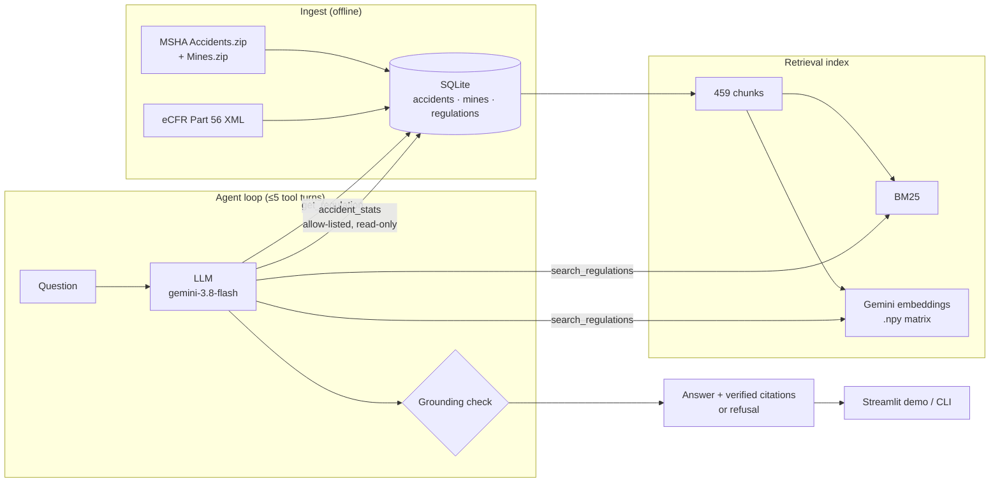

# Mine Safety Copilot

Grounded safety Q&A for US **surface metal/nonmetal** mines. It answers only from
**30 CFR Part 56** (the federal safety standards) and **MSHA accident records (2021–2024)**.
Every regulation it cites and every number it states is checked against tool output. It refuses
anything outside that scope.

**Why:** a safety engineer asking "what does the rule say about guarding conveyor pulleys, and how
many lost-time injuries involved conveyors last year?" needs the exact section and the exact count.
A plausible paraphrase isn't good enough. Wrong safety guidance is worse than no answer, so this
project optimizes for *verifiable* answers and measured refusal, not fluency.

## Architecture



- **Ingest** (`ingest/`): downloads MSHA data and the eCFR Part 56 XML and loads them into SQLite.
  The data is filtered to surface M/NM mines, with a derived `SEVERITY` column. 3,000 accidents,
  1,410 mines, 422 regulation sections. See [`docs/DATA_CARD.md`](docs/DATA_CARD.md).
- **Retrieval** (`retrieval/`): sections are chunked to about 1,500 chars, then searched with BM25,
  with dense Gemini embeddings, or with a weighted RRF hybrid. Dense is the default because it
  scored best.
- **Agent** (`agent/`): three tools. `search_regulations`, `get_regulation(section)` and
  `accident_stats`, which takes typed filters with an allow-listed `group_by`/`metric` and bound
  parameters on a read-only DB. **No text-to-SQL.**
- **Grounding check**: after the model answers, every cited § section, document number and figure
  is matched against tool output. Anything unsupported is stripped from the citations and flagged
  `ungrounded`.
- **Provider interface** (`llm.py`): `GeminiProvider` for live runs, and a scripted
  `FakeProvider` so the whole test suite runs offline.

## Results

**Agent, end to end** (30-question golden set, gemini-3.8-flash; [`evals/reports/agent.md`](evals/reports/agent.md)):

| type | n | answer acc | citation recall | refusal acc | grounded |
|---|---|---|---|---|---|
| regulation | 9 | 1.00 | 1.00 | 1.00 | 1.00 |
| aggregate stats | 7 | 1.00 | – | 1.00 | 1.00 |
| hybrid (rule + stats) | 4 | 0.75 | 1.00 | 1.00 | 1.00 |
| partial (part in scope) | 6 | 1.00 | 1.00 | 1.00 | 1.00 |
| out-of-scope (refuse) | 4 | 1.00 | – | 1.00 | 1.00 |
| **all** | **30** | **0.97** | **1.00** | **1.00** | **1.00** |

66 tool calls · ~156k input / 20k output tokens for the full run · false-refusal rate 0.00.

**What manual review changed.** The automated eval first scored 24/24. Reading the answers by hand
showed problems the scorer couldn't see: stats from the 3,000-row sample didn't say so up front,
one called the sample “representative” (it keeps every fatality, so it isn't), and keyword counts
said “involving conveyors” when they only *mention* them. Those became scoring rules, and the old
answers drop to **19/24 (0.79)** under them. A prompt fix brought that to 29/30. The remaining
miss (hyb-01 still says “involving”) is left visible rather than tuned away. Six **partial**
questions were also added. Each one is half in scope (“hard hats *and* training?”), and the copilot
should answer the covered half, then add a `Not covered:` line pointing elsewhere (e.g. Part 46
for training) instead of refusing outright or guessing. Earlier, the first M5 run (0.96) had
surfaced an empty-final-answer bug and a grounding false positive, both fixed.

**Retrieval** (13 regulation/hybrid questions, k=5; [`evals/reports/retrieval.md`](evals/reports/retrieval.md)):

| mode | recall@1 | recall@5 | MRR |
|---|---|---|---|
| BM25 | 0.54 | 0.85 | 0.65 |
| **dense** (default) | **0.92** | **0.92** | **0.92** |
| hybrid (RRF) | 0.85 | 0.85 | 0.85 |

**How the golden set was built:** `evals/build_golden.py` checks that every expected fact appears
verbatim in the section text, and every expected number comes from a SQL query against the DB.
Scoring is rule-based (no LLM judge), so a re-score is deterministic.

> **Caveat:** 30 questions written alongside the system is a regression gate, not a benchmark.
> One miss moves a type's score by 0.11–0.25.

## Quickstart

```bash
python -m venv .venv && source .venv/bin/activate
pip install -e ".[dev,demo]"
cp .env.example .env          # add GEMINI_API_KEY
```

```bash
python -m mine_copilot.ingest.build       # download + build data/processed/mine_copilot.db
python -m mine_copilot.retrieval.build    # chunk + embed (~5 min; --no-embed for BM25 only)
```

```bash
python -m mine_copilot.agent "How high must berms be on haul roads?"      # CLI (--json for full trace)
streamlit run src/mine_copilot/app.py                                       # demo UI
```

```bash
pytest -q                          # 43 tests, fully offline (fixtures + FakeProvider)
python evals/eval_retrieval.py     # retrieval report
python evals/eval_agent.py         # agent report (live API; answers cached in evals/runs/, --rescore offline)
```

The demo has an example button for each question type. It shows a refusal warning, a grounding
badge, expandable cited sections with their full text, the tool-call trace, and per-query
tokens and latency.

## Design highlights

Full rationale is in [`docs/DECISIONS.md`](docs/DECISIONS.md).

- **Allow-listed stats tool over text-to-SQL.** Text-to-SQL failures (bad joins, injection,
  silently wrong filters) are hard to detect. Typed filters cover every golden question, and when
  something goes wrong the tool returns an error the model can recover from.
- **Grounding as a post-check, not a prompt instruction.** The model is asked to cite, and the
  code then verifies each citation. Unverifiable citations are stripped and flagged, never
  silently shown.
- **Refusal is a measured behavior.** Out-of-scope questions (underground mines, coal, years
  outside 2021–2024, investment advice) are part of the golden set, and so are half-in-scope
  questions that should get a partial answer with a `Not covered:` pointer. The false-refusal
  rate is reported too.
- **Offline by default.** Fixtures and `FakeProvider` mean the tests never call the network. Eval
  answers are cached per model, so a run cut short by the rate limit picks up where it stopped.
- **Small, inspectable stack.** SQLite, a `.npy` embedding matrix and BM25; no vector DB. At
  459 chunks, brute-force search is instant and easy to debug.

## Limitations & next steps

- Scope is Part 56 only. Underground mines (Part 57) and coal (Parts 70–75) are out of scope.
- The accident sample is all fatalities plus a seeded sample, capped at 3,000 rows. Counts
  describe that sample, not the full MSHA population.
- The grounding check verifies sections and numbers. It does not verify paraphrased claims.
- The eval is small and covers only one model. Next steps: a larger held-out question set
  written by someone else, a comparison across models through the provider interface, and
  hybrid retrieval tuned on the two remaining misses.
- Not legal or compliance advice. Always check against the current eCFR.

## Repo layout

```
src/mine_copilot/   ingest/ retrieval/ agent/ llm.py config.py demo.py app.py
evals/              golden_set.yaml, build_golden.py, eval_*.py, reports/
tests/              offline tests + fixtures/
docs/               DATA_CARD.md, DECISIONS.md
```
